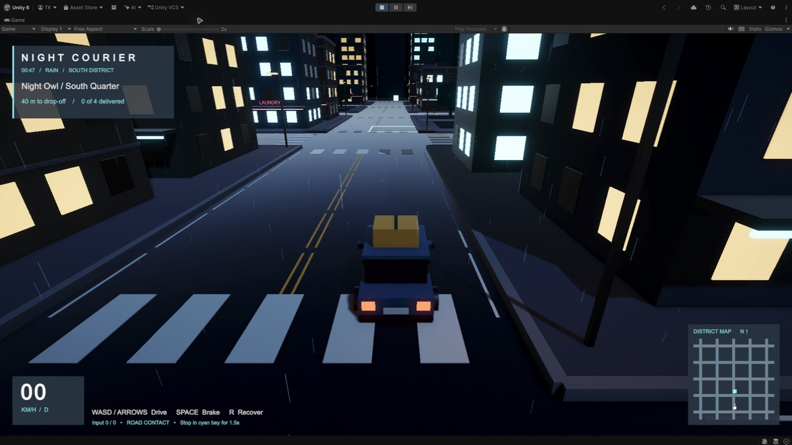
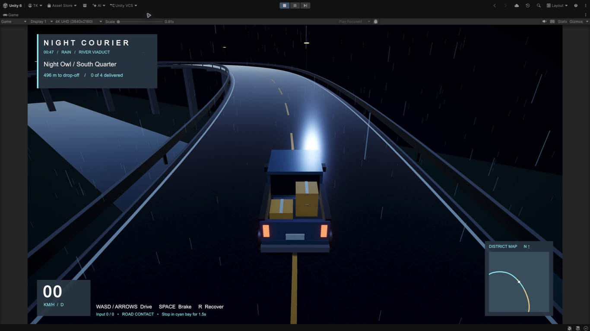

# NightCourier

A small nighttime delivery driving game built with **Unity 6000.6.0f1**, **URP 17.7.0**, and **C#** on macOS, with Windows development in mind.

The current prototype spans a 720×600 metre main city and a 600×600 metre Harbor City. A central eight-lane avenue flows directly into a 670 metre, six-lane intercity expressway with noise barriers, service area and toll plazas. Fifty-six long main-city blocks mix towers, shops, courtyard housing, warehouses, civic buildings, offices, parking structures and a park. Five EV hubs occupy reserved lots rather than traffic lanes. All geometry, surface grain, materials, minimap data, and the electric motor loop are generated by project code; no external asset downloads are required. The shift starts with an empty matte AWD pickup inside a lit, enclosed garage: drive out to Central Logistics, load eight varied parcels, then deliver them across both cities while managing a battery that begins at 50%.

## Play in Unity

1. Open the folder containing `Assets`, `Packages`, and `ProjectSettings` with Unity Hub, using **6000.6.0f1**.
2. Wait for imports and compilation to finish. If necessary, choose **Assets > Refresh**.
3. Open `Assets/_NightCourier/Scenes/DrivingPrototype.unity` from the Project window.
4. Press **Play**. The shift remains paused on the main screen. **CHOOSE CAR** (or **V**) opens a live rotating 3D selector for the electric pickup, two-seat sport model, and courier van, with five persistent exterior colours. Select **START!** (or press **Return**) to fade into the garage while the rain and vehicle audio rise smoothly. **SETTINGS** switches the menu between English and Korean; graphics currently remains locked to **MEDIUM**.
5. Click the **Game** view to focus keyboard input. Use **W/S** to accelerate/reverse, **A/D** to steer, **Space** to brake, and **R** to reset the car. Arrow keys also work. Press **Tab** for the fading pause menu with Resume, Settings, and Quit Game. Press **M** to smoothly expand the minimap into a dimmed full map, then hold the left mouse button to drag it; press **M** again to close it. The cyan route follows roads toward the next pickup or parcel, while labels and EV icons identify important places. Press **,** or **.** to toggle the left or right signal; tap both together for hazards, or hold both for two seconds to toggle the headlights and dim rear running light. Press **C** to smoothly cycle orbit chase, cockpit, hood, and front-left-wheel cameras. Hold the left mouse button and drag to look around in every camera view; changing views resets the look direction.
6. Leave the garage through its west door. The main east-west avenue at z=-30 continues directly east into the expressway. The separate scenic bypass leaves at z=130, or use **NightCourier > Explore > Hillside drive / River viaduct** while playing.
7. Stop inside the cyan destination at less than 3 km/h for the shown loading/delivery time. Finish all eight stops. Stop and re-enter Play mode to restart the route.

The city is generated when Play starts, so the scene is intentionally almost empty in Edit mode. The original URP `SampleScene` remains intact. `R` resets only the car, preserving delivery progress.

## Code layout

| Folder | Responsibility |
| --- | --- |
| `Scripts/Vehicle` | Keyboard input and fixed-step Rigidbody arcade movement |
| `Scripts/Camera` | Frame-rate-independent chase camera smoothing |
| `Scripts/Delivery` | Depot pickup, eight ordered destinations, visible cargo, stopped-time validation, responsive HUD, draggable map and route display |
| `Scripts/World` | Segmented road markings, intersections, route graph, map textures, varied buildings, boundary barriers, expressway facilities, surface palette and URP atmosphere |
| `Scripts/Prototype` | Start/pause menus, saved vehicle selection, live 3D preview and scene composition; `Vehicles/Pickup`, `Sport`, and `Van` own their distinct lamp designs |
| `Tests` | Play mode handling, pavement restart, road continuity, slopes and delivery regressions |
| `Editor` | Play mode road exploration shortcuts, excluded from player builds |

Runtime code is isolated in `NightCourier.Runtime.asmdef`. Input uses the installed Unity Input System. Each selectable vehicle has its own mass, centre of gravity, power, drag, grip, steering and collision profile: the balanced pickup approaches 200 km/h, the low 520 kW sport GT approaches 300 km/h, and the heavier van approaches 160 km/h. Lamps and wheel skins are also owned by each body so inactive vehicle parts cannot appear on the selected car. Pavements use beveled collision meshes to permit climbing. The camera retracts around obstacles. Later milestones can replace map generation with authored scenes and prefabs without putting delivery rules inside vehicle physics.

## Development

- [Setup and editor checklist](Docs/SETUP.ko.md)
- [Asset provenance](Docs/ASSETS.md)
- [Pickup physics](Docs/VEHICLE.ko.md)
- [Scenic roads, handling fixes and Editor instructions](Docs/ROADS.ko.md)
- [Expanded map, road routing and map markers](Docs/MAP.ko.md)
- [Pause menu, camera transitions and vehicle selection](Docs/MENUS.ko.md)
- Commit `Assets` **with `.meta` files**, `Packages`, and `ProjectSettings`.
- Do not commit generated `Library`, `Temp`, `Logs`, builds, or credentials.
- Keep the exact Unity version on both operating systems. Use LF text files and matching filename capitalization.

## Validation status

Validated in Unity 6000.6.0f1 on macOS with 15 Play mode regression tests covering the localized main and pause screens, audiovisual fades, saved vehicle selection, smooth camera changes, driving, recovery, acceleration, steering, eight deliveries, pavement grip, the expanded mixed-lane cities, charging, lighting, the continuous scenic road, map expansion and road-based routing. Run **NightCourier > Run Driving Regression Tests** to repeat; results are written to ignored `Logs/DrivingRegression.txt`. macOS/Windows standalone builds and sustained performance profiling remain unverified.

## Next milestones

1. Add delivery destinations and landmarks along the scenic bypass; tune handling through player feedback.
2. Add rain audio, tire sound, traffic, and stronger neighbourhood landmarks with explicit asset provenance.
3. Replace primitive geometry with redistributable free assets and authored prefabs.
4. Add delivery timing, pickup flow, results, builds, and portfolio screenshots.
